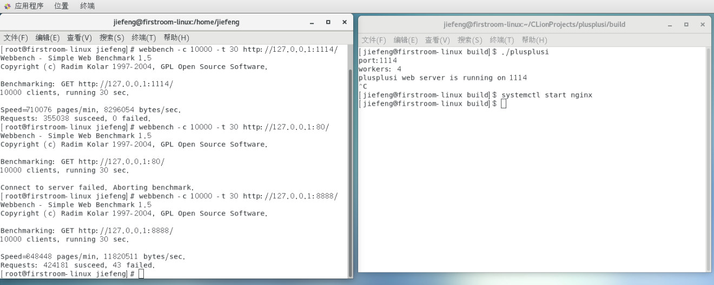
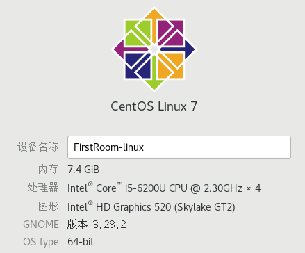

## 项目简介

项目为自己写的http服务器，已初步完工。整个项目架构为一个master进程，加上数个worker进程，worker进程负责接受连接、处理连接。目前初步写完静态页面Get方法的处理，性能方面与Nginx看齐的话，经过我初步用webbench测试的结果，在处理同一静态页面的情况下，一般能达到Nginx的70%～80%左右。因为比较依赖于CPU的性能，所以在腾讯云1核1G的小水管测试下，情况不是特别理想，但是稳定性还是足够的，webbnech测试不会出现failed，也未出现Server异常退出、重复运行造成系统资源泄露的情况。


## 项目初衷

写这个项目是目前自己意向C++后台开发，在复习的过程中，觉得自己还是有很多欠缺。“纸上觉来终觉浅，绝知此事要躬行”，虽说都说不要轻易造轮子，但是要有造轮子的实力。于是便看看自己能不能造个轮子，便写了这个项目。不同于大多数用C写的项目，这个项目是采用C++写的，基本都是封装成类，还用到了很多C++11的特性，如move语义、函数对象、STL容器等。有意向C++开发、学习网络编程的程序员们，希望这个项目也能帮到你们。


## 开发环境

+ Clion 2018.3.4
+ Centos 7，g++ 4.8.5，安装gdb


## 使用到的技术

+ epoll
+ 非阻塞IO
+ 多进程


## 已完成的功能

+ HTTP keep-alive
+ 浏览器缓存(304 Not Modified)
+ 定时器：基于C++ STL的最小堆实现、回调函数


## 编译、运行

请确保安装了cmake，并且版本在3.13及以上。若未安装或版本较低，请前往官网下载安装：[cmake](https://cmake.org/download/) .

```
mkdir build && cd build
cmake .. && make
./plusplusi (请在build目录下运行，因为读取配置文件等都是基于相对路径)
```


## 建议/注意事项

在运行前请修改conf/plusplusi.conf的woker数目，建议与CPU核数一致，以免带来不必要的进程上下文切换的开销。不过这个不一定，如果CPU核数较低，可以考虑尝试下增加woker进程数，观察下性能的变化，目前本人未测试。


## 性能测试

我在本地电脑上使用webbench进行了10000 clients，持续30s的测试。结果如下：



其中1114为plusplusi监听端口，8888为Nginx监听端口(80是打错了，请忽略...)

本人电脑配置如下，是个i5的低压U：



因为webbench本身也需要消耗资源，所以同等配置下实际能处理的连接应该更多，看到Nginx已经出现了failed，但是我的项目还是没有failed出现，开心...因为我一台笔记本带不动太多，故没有再增加并发数，应该是可以更多的。

其余在腾讯云1核1G的小水管测试，1000、2000的并发量也没什么大问题，所以感觉性能应该还是不错的。


## 更多细节

博客撰写中，撰写完成会更新链接。


